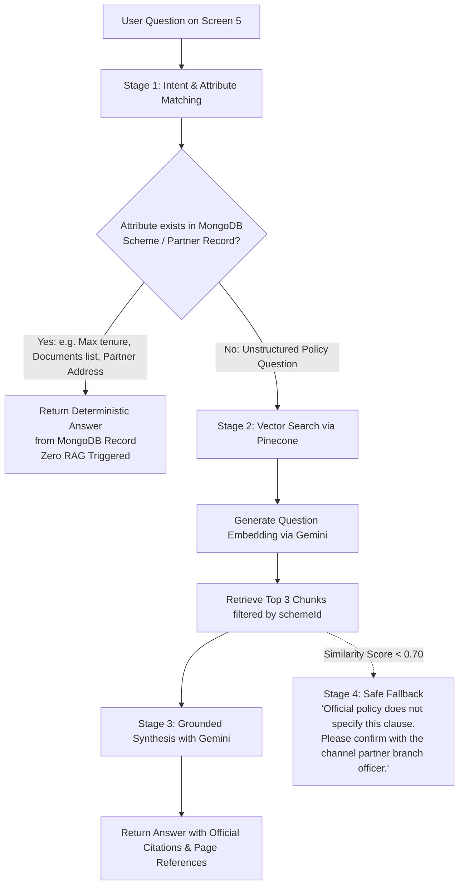

# ALIGN — AI & RAG Integration Specification

## 1. AI Architectural Principles

In ALIGN, Generative AI (Google Gemini) is utilized strictly as an **interpreter and synthesizer**, never as an authoritative decision-maker or calculation engine.

```
┌─────────────────────────────────────────────────────────────┐
│                       CORE DIRECTIVE                        │
│                                                             │
│       AI interprets.                                        │
│       Code decides.                                         │
│       Code calculates.                                      │
│       Database stores.                                      │
│       RAG retrieves.                                        │
└─────────────────────────────────────────────────────────────┘
```

---

## 2. Capability 1: Natural Language Requirement Extraction

### 2.1 Purpose & Execution
On Screen 2, users submit natural language descriptions of their livelihood needs (e.g., *"I need ₹1.2 lakh to start a tailoring business. My family income is around ₹3 lakh and I live in Kolkata."*).

Gemini translates this into a strongly typed JSON payload conforming to a strict JSON Schema.

### 2.2 Gemini Extraction System Prompt & Configuration
* **Model:** Gemini 1.5 Flash / Gemini 2.0 Flash (low latency, high structured extraction fidelity).
* **Generation Config:**
  - `temperature: 0.0` (zero creative variance)
  - `responseMimeType: "application/json"`
  - `responseSchema`: Defined below.

```typescript
export const extractionSchema = {
  type: "OBJECT",
  properties: {
    purpose: {
      type: "STRING",
      enum: ["business", "education", "agriculture", "services", "other"],
      description: "Primary intended use of the financial assistance"
    },
    businessType: {
      type: "STRING",
      description: "Specific enterprise, trade, or vocational activity (e.g. tailoring, dairy, retail shop)"
    },
    amount: {
      type: "NUMBER",
      description: "Total funding amount requested by the user in INR"
    },
    annualFamilyIncome: {
      type: "NUMBER",
      description: "Total annual household/family income in INR"
    },
    location: {
      type: "STRING",
      description: "City, district, or town mentioned by the applicant"
    },
    educationStatus: {
      type: "STRING",
      nullable: true,
      description: "Academic or professional qualification if mentioned, else null"
    }
  },
  required: ["purpose", "businessType", "amount", "annualFamilyIncome", "location"]
};
```

### 2.3 Pre-Rule-Engine Validation Layer
Before Gemini's output reaches the Rule Engine, Express validation middleware verifies:
1. `amount` is a positive number $> 0$ and $\le 10,00,00,000$.
2. `annualFamilyIncome` is a positive number $\ge 0$.
3. `location` is sanitized against injection attacks.
4. **Authoritative Shield:** Even if Gemini mistakenly returned `"eligible": true`, the middleware strips any unauthorized fields. Only verified parameters pass into the Rule Engine.

---

## 3. Capability 2: What-If Scenario Interpretation

### 3.1 Purpose & Conversational Flow
On Screen 3 (Comparison), the user interacts with the floating What-If Assistant at the bottom of the screen.

```mermaid
sequenceDiagram
    actor User
    participant AssistantUI as What-If Drawer UI
    participant Gemini as Gemini AI
    participant FinEngine as Financial Engine
    participant MatrixUI as Comparison Cards

    User->>AssistantUI: "What if I repay over 5 years?"
    AssistantUI->>Gemini: Parse query against current state (amount: 120000, tenure: 36)
    Gemini-->>AssistantUI: Structured Delta: { tenureMonths: 60 }
    AssistantUI->>FinEngine: Compute new EMIs for all 3 schemes at 60 months
    FinEngine-->>AssistantUI: New EMIs, interest totals, and tenure-capping flags
    AssistantUI->>Gemini: Synthesize plain-language explanation from calculated delta
    Gemini-->>AssistantUI: "Extending tenure to 5 years lowers your monthly EMI on Term Loan to ₹2,433, though total interest increases to ₹25,990. Note that Micro Finance is capped at 3 years."
    AssistantUI->>User: Displays explanation + delta pills + "Apply Scenario" button
    User->>AssistantUI: Clicks "Apply Scenario"
    AssistantUI->>MatrixUI: Commits 60 months to Universal Calculator; all cards update
```

### 3.2 Structured Output Schema for What-If Queries
```typescript
export const whatIfInterpretationSchema = {
  type: "OBJECT",
  properties: {
    loanAmount: {
      type: "NUMBER",
      nullable: true,
      description: "Modified principal amount in INR if user requested an amount change"
    },
    tenureMonths: {
      type: "NUMBER",
      nullable: true,
      description: "Modified repayment tenure in months if user requested a duration change"
    }
  }
};
```

---

## 4. Capability 3: Hierarchical Grounded Assistant (Screen 5)

On Screen 5, users can ask detailed questions regarding the selected scheme and partner (e.g., *"Can I apply without an income certificate?"* or *"What happens after I submit my application?"*).

### 4.1 Hierarchical Routing Architecture
To optimize latency, reduce API costs, and guarantee deterministic accuracy, the assistant adheres to a strict four-stage decision tree:



### 4.2 Non-RAG Trigger Conditions (When RAG is NOT Used)
1. **Basic Scheme Discovery:** Never uses RAG. Handled by MongoDB query + Rule Engine.
2. **EMI / Repayment Calculations:** Never uses RAG. Handled by Financial Engine.
3. **Document List Verification:** Never uses RAG. Handled by `scheme.documents` array in MongoDB.
4. **Partner Addresses / Contact Details:** Never uses RAG. Handled by `partners` collection.

---

## 5. RAG Pipeline Technical Implementation

### 5.1 Document Ingestion & Chunking
* **Corpus:** Official policy circulars and lending scheme guidelines (e.g. *NSFDC Lending Policy Guidelines 2024-25*).
* **Chunking Strategy:** Recursive Character Text Splitter with `chunk_size = 600`, `chunk_overlap = 100`.
* **Metadata Attachment:** Every chunk is tagged with:
  ```json
  {
    "schemeId": "SCHEME-NSFDC-MF-01",
    "documentTitle": "NSFDC Lending Policy Handbook 2024",
    "section": "Clause 4.2: Income Criteria & Documentation",
    "pageNumber": 14,
    "officialUrl": "https://nsfdc.nic.in/en/schemes/micro-credit"
  }
  ```

### 5.2 Retrieval & Grounded Generation Prompt
```
You are ALIGN's Scheme Decision-Support Assistant. 
You are advising a marginalized micro-entrepreneur regarding the government scheme: {schemeName}.

CONTEXT FROM OFFICIAL GOVERNMENT SCHEME CIRCULARS:
{retrieved_chunks}

USER QUESTION:
{user_question}

STRICT OPERATIONAL GUIDELINES:
1. Answer the question using ONLY the provided official context.
2. If the context does not explicitly state the answer, do NOT speculate or invent rules. Instead, explicitly state:
   "The available official scheme documentation does not specify this condition. Please verify directly with the nodal officer at your selected channel partner ({partnerName})."
3. Keep the language simple, reassuring, and accessible to a first-time borrower. Avoid legalistic jargon.
4. Cite the official circular title and section at the end.
```

---

## 6. Hallucination Safeguards & Defensive Engineering

1. **Temperature Capping:** All generation prompts operate between `0.0` and `0.2` temperature.
2. **Negative Constraint Enforcement:** The system prompt explicitly commands the model not to bridge information gaps with general world knowledge about other loan types.
3. **Grounding Citation Guarantee:** Responses generated via RAG include structured metadata citations allowing the frontend to render a clickable link to the verified official source.
4. **Fallback Resilience:** If Pinecone or the vector pipeline encounters network timeouts during a live hackathon pitch, the assistant gracefully falls back to structured MongoDB fields and channel partner advisory notes.

---

## 7. Open Decisions

| ID | Issue | Detail | Proposed Resolution |
| :--- | :--- | :--- | :--- |
| OD-AI1 | Vector Database Hosting | Local ChromaDB vs Pinecone Serverless. | Use Pinecone Serverless for production-ready retrieval; provide an in-memory/JSON fallback vector store for offline hackathon environments. |
| OD-AI2 | Audio / Speech Input Hook | Beneficiaries with low textual literacy benefit from voice input. | Document frontend Web Speech API integration hook for Screen 2 (`webkitSpeechRecognition`) as a Should-Have enhancement. |
