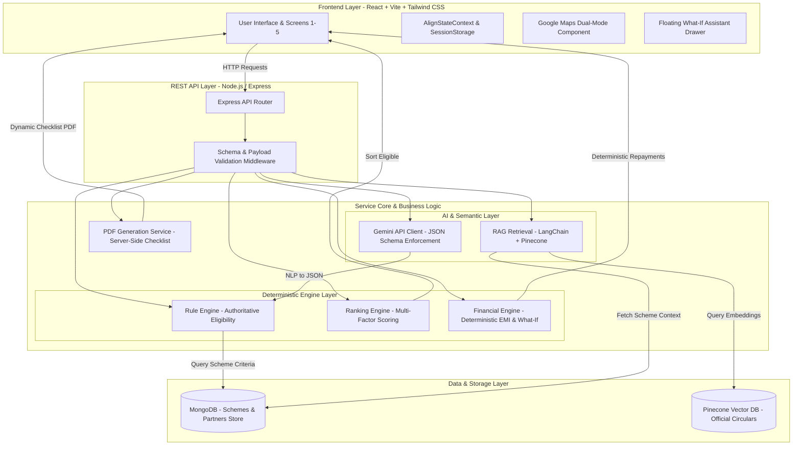
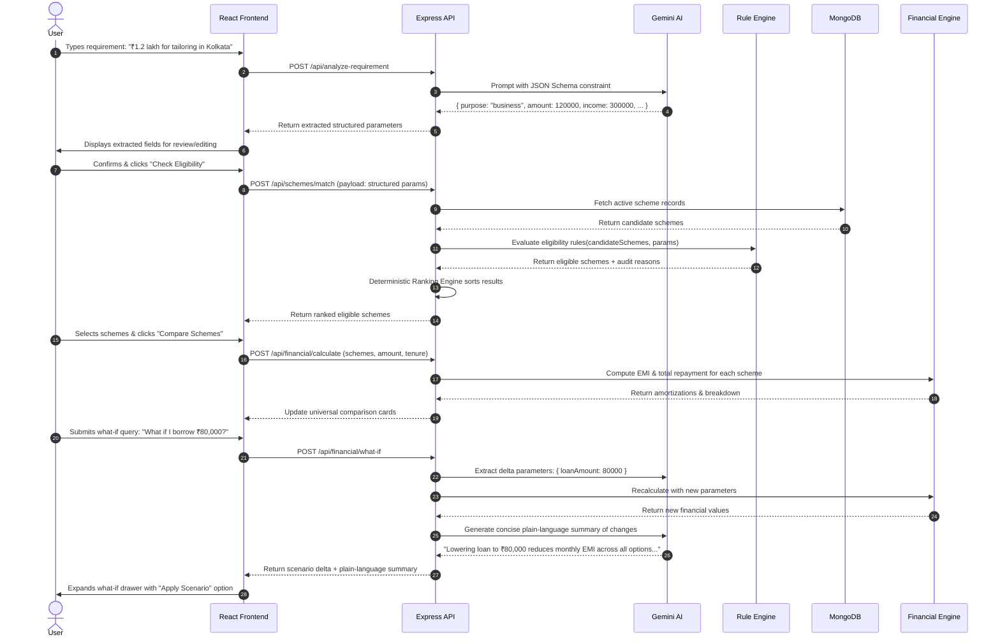

# ALIGN — System Architecture Specification

## 1. High-Level Architectural Vision

ALIGN is architected as a modular, decoupled decision-support platform designed to completely prevent generative AI hallucinations in critical financial decisions. Generative AI is strictly confined to semantic interpretation and conversational synthesis, while all authoritative logic—eligibility determinations, ranking, and financial calculations—is executed by deterministic, auditable code.



---

## 2. Core Architectural Principles & Responsibility Boundaries

| System Layer | Primary Responsibility | Strict Prohibitions |
| :--- | :--- | :--- |
| **Gemini AI** | **Interprets.** Converts unstructured user prompts into structured JSON; synthesizes retrieved policy excerpts into plain-language answers. | **NEVER** decides scheme eligibility.<br>**NEVER** calculates EMI, total repayment, or interest. |
| **Rule Engine** | **Decides.** Tests structured user parameters against MongoDB scheme constraints; produces auditable eligibility verdicts and plain-language reasons. | Does not generate conversational responses.<br>Does not modify data schemas dynamically. |
| **Financial Engine** | **Calculates.** Executes standard reducing-balance amortization formulas; calculates moratorium interest; computes what-if deltas. | Does not infer user intent.<br>Does not accept unvalidated inputs. |
| **MongoDB** | **Stores.** Single source of truth for verified scheme guidelines, partner branch details, and document requirements. | Contains no unverified, speculative, or fabricated loan terms. |
| **Pinecone & RAG** | **Retrieves.** Indexes official government PDFs and policy circulars; serves as fallback when structured fields do not answer specific user questions. | Not used for basic scheme discovery, filtering, or standard calculations. |

---

## 3. Detailed Component Architecture

### 3.1 Frontend Architecture (Client)
* **Framework:** React 18+ with Vite for fast HMR and optimized production bundles.
* **Routing:** React Router v6 with declarative routes:
  - `/` — Landing Page
  - `/match` — Natural Language AI Scheme Matching
  - `/compare` — Multi-Scheme Comparison & Universal Calculator
  - `/partners` — Channel Partner Discovery & Interactive Maps
  - `/guidance` — Application Roadmap, Checklist & PDF Download
* **Styling & Design System:** Tailwind CSS configured with ALIGN's Google Stitch design tokens (calm neutrals, charcoal typography, restrained slate blues and sage greens).
* **State Management:**
  - `AlignStateContext`: Central React Context wrapping the application.
  - `sessionStorage` synchronization: Ensures that deep navigations and page refreshes do not drop user context, while avoiding persistent local storage pollution.
* **Maps Integration:** `@react-google-maps/api` embedded in an interactive container supporting instantaneous CSS toggle between Compact Mode (60/40 list-dominant) and Expanded Mode (80/20 map-dominant).

### 3.2 Backend Architecture (Server)
* **Runtime & Framework:** Node.js (LTS) with Express.js.
* **Architecture Pattern:** Layered Controller-Service-Repository pattern.
  - `routes/`: Express endpoint definitions with input sanitization.
  - `controllers/`: Request handling and HTTP response orchestration.
  - `services/`: Isolated business logic modules:
    - `gemini.service.js`: Calls Google Gemini SDK with strict JSON Schema definitions.
    - `ruleEngine.service.js`: Pure function rule evaluator.
    - `ranking.service.js`: Multi-attribute deterministic scoring function.
    - `financial.service.js`: Pure mathematical amortization functions.
    - `rag.service.js`: LangChain + Pinecone semantic document retriever.
    - `pdf.service.js`: Server-side PDF generation utility.
  - `models/`: Mongoose schemas for MongoDB collections.

### 3.3 Database & Vector Store Architecture
* **Primary Database:** MongoDB Atlas / Local MongoDB.
  - `schemes` collection: Stores official scheme parameters, financial rules, documents, and application roadmaps.
  - `partners` collection: Stores channel partner entities (SCAs, PSBs, RRBs, etc.) with geo-coordinates and authorized schemes.
* **Vector Database:** Pinecone (Serverless index, cosine metric, 768/1536 dimensions matching Gemini text embeddings).
  - Contains chunked, verified PDF guidelines (e.g., *NSFDC Lending Policy Circular 2024-25*).
  - Chunks include rich metadata (`schemeId`, `section`, `officialUrl`, `pageNumber`).

---

## 4. End-to-End Data Flow Sequence

The diagram below details the exact request-response sequence for the primary user journey:



---

## 5. Subsystem Detailed Specifications

### 5.1 Rule Engine Architecture
* **Input:** Validated `UserRequirement` object.
* **Logic:** Iterates through every active scheme and tests:
  1. `annualFamilyIncome <= scheme.incomeLimit` (Default limit: ₹5,00,000).
  2. `amount <= scheme.maxLoanAmount`.
  3. `amount <= scheme.projectCostLimit` (or within project range).
  4. `purpose` matches `scheme.purpose` or allowed categories.
  5. Any specific beneficiary / category criteria.
* **Output:** Structured evaluation array:
  ```json
  {
    "schemeId": "SCHEME-NSFDC-MF-01",
    "eligible": true,
    "reasons": [
      "Annual family income ₹3,00,000 is within scheme ceiling of ₹5,00,000",
      "Requested ₹1,20,000 is within max loan ceiling of ₹1,25,000",
      "Stated enterprise (Tailoring) is covered under microfinance guidelines"
    ],
    "violations": [],
    "missingInformation": []
  }
  ```

### 5.2 Deterministic Ranking Engine Architecture
* **Scoring Weights:**
  - **Purpose Fit (35%):** Exact business activity match vs general enterprise.
  - **Amount Suitability (25%):** Closeness of requested amount to scheme sweet spot without exceeding limit.
  - **Interest Rate Competitiveness (20%):** Lower concessional interest rates receive higher rank.
  - **Repayment Flexibility (20%):** Favorable tenure and moratorium periods.
* **Output:** Ranked array with human-readable "Recommended because..." justification badges.

### 5.3 Financial Engine Architecture
* **Pure Mathematical Formulas:**
  $$\text{Monthly EMI} = P \times r \times \frac{(1+r)^n}{(1+r)^n - 1}$$
  where $P$ is principal, $r = \frac{\text{annual rate}}{12 \times 100}$, and $n$ is tenure in months.
* **Total Repayment:** $\text{EMI} \times n$
* **Total Interest:** $\text{Total Repayment} - P$
* **Moratorium Consideration:** Explicitly documents whether interest accrues during grace period (simple interest) or is deferred without penalty.

### 5.4 RAG Engine Architecture
* **Trigger Condition:** Used **ONLY** on Screen 5 (Scheme Assistant) when a user's question cannot be resolved by querying structured MongoDB attributes.
* **Pipeline:**
  1. User question received: *"Can I apply if my shop is rented?"*
  2. Rule check: Check if `scheme.guidance` or `scheme.documents` contains the answer. If yes $\rightarrow$ respond immediately.
  3. Vector search: Generate query embedding $\rightarrow$ query Pinecone for top 3 matching chunks filtered by `schemeId`.
  4. Prompt synthesis: Feed retrieved chunks into Gemini with strict grounding instructions:
     *"Answer the question ONLY using the provided excerpts. If the information is not in the text, clearly state that the borrower must confirm with their channel partner branch officer."*
  5. Return synthesized answer with chunk source references and page citations.

---

## 6. Security, Resilience & Hallucination Safeguards

1. **Deterministic Guardrails:** The frontend never accepts arbitrary LLM-generated numbers for financial cards. All cards bind directly to the JSON response of `financial.service.js`.
2. **Strict Temperature Settings:** Gemini API calls for parameter extraction are executed with `temperature: 0.0` and strict JSON Schema constraints.
3. **Graceful Fallbacks:**
   - If Google Maps API fails or has no key, the UI automatically falls back to an accessible interactive SVG list-map grid.
   - If Pinecone RAG is unreachable, the AI assistant responds using structured MongoDB fields and directs the user to the verified channel partner helpdesk.

---

## 7. Open Architectural Decisions

| ID | Subject | Options Considered | Decision / Recommendation |
| :--- | :--- | :--- | :--- |
| AD-1 | PDF Generation Engine | Option A: Puppeteer (headless Chrome)<br>Option B: PDFKit (pure Node.js) | **Decision: PDFKit.** Puppeteer introduces heavy OS-level binary dependencies that often fail in hackathon / lightweight container environments. PDFKit is pure JavaScript and guarantees instant, zero-dependency PDF rendering. |
| AD-2 | Map Provider Fallback | Option A: Hard dependency on Google Maps<br>Option B: Hybrid Leaflet / OpenStreetMap fallback | **Decision: Hybrid fallback.** Use Google Maps when `VITE_GOOGLE_MAPS_API_KEY` is present; seamlessly render Leaflet / OpenStreetMap or interactive SVG if the key is missing or quota is exhausted. |
