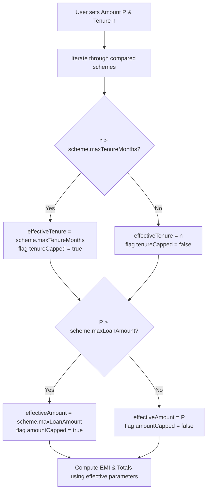

# ALIGN — Deterministic Financial Engine Specification

## 1. Core Principle & Architectural Isolation

> [!IMPORTANT]
> **Zero Generative Math Policy**
> Under no circumstances may Gemini, an LLM, or any probabilistic AI model calculate, interpolate, or verify Equated Monthly Installments (EMI), interest totals, or repayment schedules.
> 
> All financial arithmetic is performed by a dedicated, deterministic JavaScript/TypeScript module (`financial.service.js`) governed by standard actuarial reducing-balance formulas.

---

## 2. Mathematical Formulations

### 2.1 Standard Reducing-Balance EMI Calculation
For a loan with regular monthly repayments, the Equated Monthly Installment ($E$) is calculated as:

$$E = P \cdot r \cdot \frac{(1+r)^n}{(1+r)^n - 1}$$

Where:
* $P$ = Principal loan amount in INR (e.g., ₹1,20,000)
* $R$ = Annual interest rate in percent (e.g., 6.5% p.a.)
* $r$ = Monthly periodic interest rate = $\frac{R}{12 \times 100} = \frac{6.5}{1200} \approx 0.0054167$
* $n$ = Repayment tenure in months (e.g., 36 months)

#### Edge Case: Zero-Interest Scheme ($R = 0$)
If a specialized scheme offers a 0% interest subsidy, the formula simplifies to prevent division by zero:
$$E = \frac{P}{n}$$

---

### 2.2 Total Repayment & Total Interest
* **Total Repayment Amount ($T$):**
  $$T = E \times n$$
* **Total Interest Payable ($I$):**
  $$I = T - P$$

---

### 2.3 Quarterly Repayment Handling
Where a scheme specifies quarterly repayment frequencies (e.g., certain rural or seasonal agricultural cycles):
* $r_q$ = Quarterly periodic interest rate = $\frac{R}{4 \times 100}$
* $n_q$ = Total quarterly installments = $\left\lfloor\frac{n}{3}\right\rfloor$
* Periodic Installment:
  $$E_q = P \cdot r_q \cdot \frac{(1+r_q)^{n_q}}{(1+r_q)^{n_q} - 1}$$

---

### 2.4 Moratorium (Grace Period) Model
Most government concessional schemes (such as NSFDC Micro Finance and Term Loans) provide an initial moratorium (e.g., 3 to 6 months) allowing the enterprise to generate cash flows before principal amortization commences.

In the ALIGN prototype:
1. **Principal Holiday:** The borrower does not pay principal during the moratorium period ($m$ months).
2. **Interest Treatment:** Simple interest accrues during the moratorium:
   $$I_{\text{mora}} = P \times \left(\frac{R}{100}\right) \times \left(\frac{m}{12}\right)$$
3. **Amortization Options:**
   - **Model A (Standard Government Practice - Adopted for MVP):** Moratorium is a grace window prior to regular $n$-month amortization. The regular monthly EMI begins from month $m+1$ over the approved $n$ months. Interest accrued during moratorium is either paid in lump sum at month $m+1$ or capitalized into $P$. For the prototype display, the regular EMI is shown with an explanatory note: *"Repayments begin after a 3-month moratorium"*.

---

## 3. Scheme Constraints & Boundary Validation

When the user adjusts the Universal Calculator on Screen 3, the requested loan amount ($P_{\text{req}}$) and tenure ($n_{\text{req}}$) are evaluated against each scheme's specific regulatory ceilings:



### Constraint Rules:
1. **Tenure Capping:**
   - If user sets Tenure = 60 months (5 years), but Scheme 1 (*Micro Finance*) has `maxTenureMonths: 36`, Scheme 1 is calculated at **36 months**, and marked with:
     `tenureCapped: true`, `note: "Tenure capped at scheme limit of 36 months"`.
   - Scheme 3 (*Term Loan*), having `maxTenureMonths: 84`, is calculated at **60 months**.
2. **Amount Capping:**
   - If user increases Amount to ₹2,00,000, Scheme 1 (*Micro Finance*, limit ₹1,25,000) displays an informative constraint warning: *"Requested amount exceeds maximum scheme limit of ₹1.25 lakh"*.

---

## 4. What-If Delta Analysis

The What-If Engine computes the financial differential between the user's active baseline scenario and an exploratory scenario.

### Formula for Delta Representation:
$$\Delta \text{EMI} = E_{\text{new}} - E_{\text{baseline}}$$
$$\Delta \text{Interest} = I_{\text{new}} - I_{\text{baseline}}$$

* If $\Delta \text{EMI} < 0$: User saves $|\Delta \text{EMI}|$ per month (rendered in reassuring sage green e.g. `-₹1,226 / month`).
* If $\Delta \text{EMI} > 0$: Monthly installment increases by $\Delta \text{EMI}$ (rendered in warm neutral charcoal).

---

## 5. Reference Implementation (Pure Node.js / TypeScript)

```typescript
export interface FinancialInput {
  principal: number;
  annualInterestRate: number;
  tenureMonths: number;
  maxTenureMonths?: number;
  maxLoanAmount?: number;
  moratoriumMonths?: number;
}

export interface FinancialOutput {
  monthlyEMI: number;
  totalRepayment: number;
  totalInterest: number;
  effectivePrincipal: number;
  effectiveTenureMonths: number;
  tenureCapped: boolean;
  amountCapped: boolean;
  moratoriumMonths: number;
}

export function calculateSchemeEMI(input: FinancialInput): FinancialOutput {
  const {
    principal,
    annualInterestRate,
    tenureMonths,
    maxTenureMonths = 360,
    maxLoanAmount = Infinity,
    moratoriumMonths = 0
  } = input;

  // Enforce regulatory ceilings
  const tenureCapped = tenureMonths > maxTenureMonths;
  const effectiveTenureMonths = tenureCapped ? maxTenureMonths : tenureMonths;

  const amountCapped = principal > maxLoanAmount;
  const effectivePrincipal = amountCapped ? maxLoanAmount : principal;

  // Zero-interest edge case
  if (annualInterestRate === 0) {
    const monthlyEMI = Math.round((effectivePrincipal / effectiveTenureMonths) * 100) / 100;
    const totalRepayment = effectivePrincipal;
    return {
      monthlyEMI,
      totalRepayment,
      totalInterest: 0,
      effectivePrincipal,
      effectiveTenureMonths,
      tenureCapped,
      amountCapped,
      moratoriumMonths
    };
  }

  // Standard Reducing Balance Calculation
  const monthlyRate = annualInterestRate / (12 * 100);
  const factor = Math.pow(1 + monthlyRate, effectiveTenureMonths);
  const monthlyEMI = Math.round(
    (effectivePrincipal * monthlyRate * factor / (factor - 1)) * 100
  ) / 100;

  const totalRepayment = Math.round((monthlyEMI * effectiveTenureMonths) * 100) / 100;
  const totalInterest = Math.round((totalRepayment - effectivePrincipal) * 100) / 100;

  return {
    monthlyEMI,
    totalRepayment,
    totalInterest,
    effectivePrincipal,
    effectiveTenureMonths,
    tenureCapped,
    amountCapped,
    moratoriumMonths
  };
}
```

---

## 6. Verification Test Cases

| Scenario | Principal ($P$) | Rate ($R$) | Tenure ($n$) | Expected EMI | Expected Total Repayment | Expected Total Interest |
| :--- | :--- | :--- | :--- | :--- | :--- | :--- |
| **Demo Baseline (Micro Finance)** | ₹1,20,000 | 6.5% | 36 mo | **₹3,678.38** | **₹1,32,421.68** | **₹1,242.17** |
| **What-If ₹80,000 (Micro Finance)** | ₹80,000 | 6.5% | 36 mo | **₹2,452.25** | **₹88,281.00** | **₹8,281.00** |
| **Aajeevika Micro-Finance (15%)** | ₹1,20,000 | 15.0% | 36 mo | **₹4,159.84** | **₹1,49,754.24** | **₹29,754.24** |
| **Term Loan (8%)** | ₹1,20,000 | 8.0% | 36 mo | **₹3,760.36** | **₹1,35,372.96** | **₹15,372.96** |
| **Term Loan Extended (5 yrs)** | ₹1,20,000 | 8.0% | 60 mo | **₹2,433.17** | **₹1,45,990.20** | **₹25,990.20** |

---

## 7. Open Decisions

| ID | Issue | Detail | Proposed Resolution |
| :--- | :--- | :--- | :--- |
| OD-FE1 | Moratorium Interest Capitalization | In bank practice, simple interest during the moratorium can be either capitalized into principal or collected before EMI starts. | For clear user communication, present the standard monthly EMI for the $n$-month tenure, with a transparent note detailing the 3-month interest holiday. |
| OD-FE2 | Rounding Precision | Fractional paisa rounding can lead to minor differences between $E \times n$ and actual amortization schedules. | Use standard standard 2-decimal rounding (`Math.round(val * 100) / 100`) for all currency displays. |
