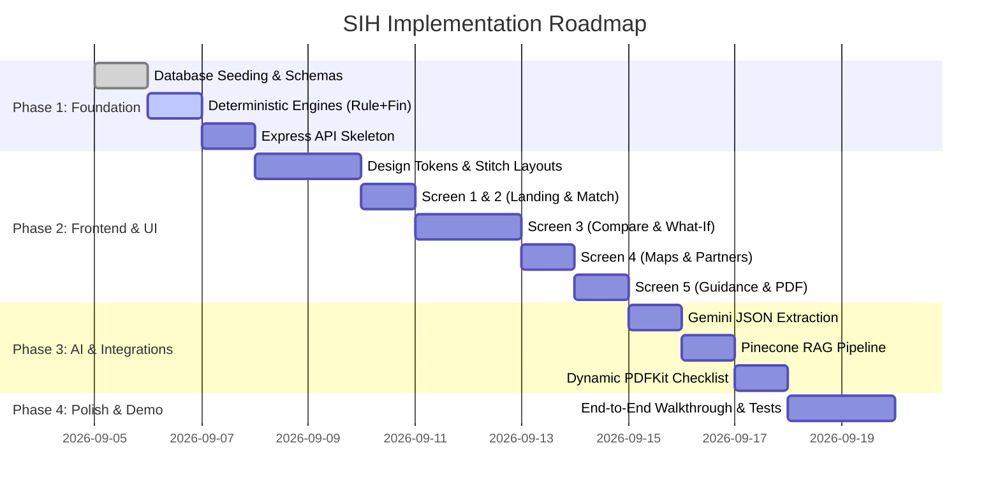

# ALIGN — MVP Scope & Feature Prioritization Matrix

## 1. Scope Governance Principles

To deliver a flawless, high-impact prototype for the Smart India Hackathon (SIH 2026), ALIGN follows a disciplined scoping framework. The focus is on **executing one complete, end-to-end user journey with zero bugs, zero mathematical errors, and zero generative hallucinations**, rather than building shallow, half-finished enterprise features.

---

## 2. MoSCoW Prioritization Matrix

```
┌─────────────────────────────────────────────────────────────┐
│                    MoSCoW CLASSIFICATION                    │
├──────────────────────────────┬──────────────────────────────┤
│  MUST HAVE                   │  SHOULD HAVE                 │
│  - Dual-path user journey    │  - Multilingual UI toggles   │
│  - NLP requirement extraction│  - Speech-to-text input hook │
│  - Deterministic rule engine │  - Amortization breakdown    │
│  - Universal calculator      │  - Filter tags by partner    │
│  - Floating What-If AI       │                              │
│  - Interactive map & sync    │                              │
│  - Dynamic PDF generation    │                              │
│  - Grounded RAG assistant    │                              │
│  - 5 verified schemes        │                              │
│  - 4 Kolkata demo partners   │                              │
├──────────────────────────────┼──────────────────────────────┤
│  NICE TO HAVE                │  OUT OF SCOPE                │
│  - WhatsApp checklist export │  - User auth / login screens │
│  - Offline PWA caching       │  - Gov application portal    │
│  - SMS partner directions    │  - Loan approval / scoring   │
│                              │  - Payment gateways          │
│                              │  - Admin dashboards          │
│                              │  - 100+ partner database     │
│                              │  - Real-time fund utilization│
│                              │  - Mobile native app         │
│                              │  - OCR doc scanner           │
└──────────────────────────────┴──────────────────────────────┘
```

---

## 3. Detailed Scope Breakdown

### 3.1 MUST HAVE (Core Hackathon Prototype)

#### Frontend (React + Vite + Tailwind)
* Complete 5-screen flow:
  1. `/` — Landing Page with clear value proposition and CTA.
  2. `/match` — Natural language prompt box, Gemini extraction review panel, rule engine matching cards with explainable badges.
  3. `/compare` — 3-column side-by-side comparison matrix, sticky Universal Calculator (amount & tenure sliders), docked What-If Assistant with plain-language explanation and "Apply Scenario" action.
  4. `/partners` — Split screen with partner cards and Google Maps integration, compact vs expanded map toggle, synchronized marker/card active state.
  5. `/guidance` — Application readiness summary, categorized document checklist, step-by-step submission roadmap, dynamic PDF download button, and scheme-specific AI assistant.
* Central React Context (`AlignStateContext`) backed by `sessionStorage` to preserve state across back/forward navigation and reloads.
* Faithful implementation of Google Stitch design tokens (warm linen `#FAF8F5`, charcoal `#1F2421`, forest green `#1E3A2F`, slate navy `#2B4C6F`).

#### Backend (Node.js + Express + MongoDB)
* REST API endpoints: `/api/analyze-requirement`, `/api/schemes/match`, `/api/schemes`, `/api/schemes/:id`, `/api/financial/calculate`, `/api/financial/what-if`, `/api/partners`, `/api/schemes/:id/partners`, `/api/schemes/:id/documents`, `/api/schemes/:id/application-guidance`, `/api/pdf/application-checklist`, `/api/assistant/question`.
* **Deterministic Rule Engine:** Pure function evaluating income limits ($\le$ ₹5,00,000), loan caps, purpose fit, and returning human-readable audit reasons.
* **Deterministic Ranking Engine:** Multi-factor scoring prioritizing purpose fit, concessional interest rates, and loan amount alignment.
* **Deterministic Financial Engine:** Actuarial reducing-balance EMI calculations, total repayment, total interest, and moratorium notes.

#### AI & RAG Integration
* Gemini 1.5/2.0 Flash integration with strict JSON Schema output for parameter extraction and what-if query parsing.
* Hierarchical Q&A router: Checks structured MongoDB fields first; triggers Pinecone vector search over official NSFDC circulars only when structured data is absent.
* Grounded citations (official circular title, section clause, and URL) on every RAG answer.

#### Data & Integration
* 5 verified government schemes seeded in MongoDB:
  1. NSFDC Micro Finance Scheme (6.5% interest, max ₹1.25L, 3 yrs)
  2. Aajeevika Micro-Finance Yojana (15% interest, max ₹1.25L, 3 yrs)
  3. NSFDC Term Loan Scheme (8% interest, max ₹45L, 7 yrs)
  4. Udyam Nidhi Yojana (13% / 15% interest, max ₹4.5L, 5 yrs)
  5. NSFDC Educational Loan Scheme (6.5% interest, max ₹40L, 10-12 yrs)
* 4 realistic demo channel partners for the Kolkata demonstration district (SCA, PSB, RRB, SFB).
* Dynamic server-side PDF generator (`pdf.service.js` using PDFKit) returning branded, personalized checklist PDFs.

---

### 3.2 SHOULD HAVE (Secondary Polish)
* **Monthly Amortization Schedule Modal:** Visual month-by-month table showing principal vs interest breakdown on Screen 3.
* **Multilingual UI Toggle (Hindi / Bengali / English):** Localization for UI labels and key headings.
* **Web Speech API Hook:** Microphone button on Screen 2 to allow voice dictation for the natural language requirement.
* **Direct Partner Contact Card Actions:** Click-to-call (`tel:`) and click-to-email (`mailto:`) links on partner cards.

---

### 3.3 NICE TO HAVE (Post-Hackathon Roadmap)
* **WhatsApp Notification Bot:** Exporting the dynamic checklist PDF and partner address directly to the user's WhatsApp number.
* **Progressive Web App (PWA) Offline Shell:** Basic caching of scheme documents for rural entrepreneurs with intermittent connectivity.
* **SMS Gateway Integration:** Sending an SMS reminder with the channel partner's address and office timings.

---

### 3.4 OUT OF SCOPE (Explicitly Prohibited for MVP)

| Feature | Rationale for Exclusion |
| :--- | :--- |
| **User Authentication / Sign-up / Login** | Adds unnecessary onboarding friction. Borrowers want immediate scheme discovery. Session storage is sufficient for MVP. |
| **Direct Government Application Submission** | Apex corporations (NSFDC) mandate physical verification and biometric KYC via channel partners; direct digital submission does not exist for this lending tier. |
| **Loan Approval / Credit Scoring** | ALIGN is an advisory and decision-support platform, not a non-banking financial company or lending institution. |
| **Payment Gateway / Fee Collection** | Concessional government schemes have zero upfront application fees. Adding payments would misrepresent the product. |
| **Admin Dashboard / CMS Portal** | Focus must remain on the entrepreneur's user experience. Schemes are managed via automated MongoDB seed scripts. |
| **100+ Channel Partner Ingestion** | A small, verified 4-partner dataset for Kolkata proves the architecture without wasting hackathon hours on manual data entry. |
| **Real-time Partner Fund Utilization** | State Channelising Agencies do not expose live fund balance APIs. Displaying unverified "fund utilization" numbers would mislead users. |
| **OCR Document Scanner** | Adding optical character recognition for income certificates adds complexity and failure points without improving the core decision journey. |

---

## 4. Implementation Phasing & Milestones



---

## 5. Open Decisions

| ID | Issue | Detail | Proposed Resolution |
| :--- | :--- | :--- | :--- |
| OD-MS1 | Pre-seeded vs Live API for Gemini | If hackathon venue has poor internet, will live Gemini calls fail? | Implement an automatic mock fallback toggle (`USE_MOCK_AI=true`) in the Express backend so that the demo scenario can run with 100% reliability even if venue internet disconnects. |
