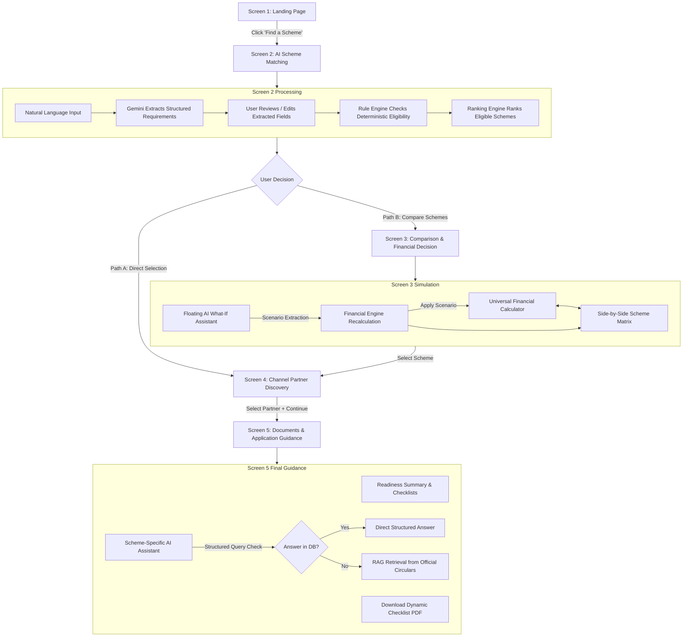

# ALIGN — User Flow & Journey Specification

## 1. Journey Overview & Dual-Path Architecture

ALIGN implements a convergent dual-path user journey designed for clarity and flexibility. A user can either immediately select a top-matching scheme or enter a comparative decision workspace with real-time financial simulation. Both pathways converge seamlessly into physical Channel Partner Discovery and Personalized Application Guidance.



---

## 2. Screen-by-Screen Specification

### Screen 1: Landing Page
* **Route:** `/`
* **Purpose:** Introduce ALIGN's mission with warm, accessible visual framing; build trust; direct the user straight into discovery.
* **Authentication State:** Zero authentication. No login, signup, or phone verification for the MVP.
* **Key Components:**
  - **Header:** Minimalist ALIGN wordmark, tagline: *"Smart financial scheme discovery for marginalized entrepreneurs"*, demo indicator pill (*"SIH Prototype v1.0"*).
  - **Hero Section:** Clear headline: *"Find Government Financial Support Built for Your Enterprise"*.
  - **Key Trust Pillars:** Transparent Concessional Rates, Verified Channel Partners, Deterministic Eligibility (No Black Box AI).
  - **Primary CTA:** Prominent button labeled **`Find a Scheme`** linking directly to `/match`.
* **User Action:** User clicks `Find a Scheme`.

---

### Screen 2: AI Scheme Matching
* **Route:** `/match`
* **Purpose:** Capture user intent in natural language, expose parsed parameters for user transparency, execute rule-engine matching, and display ranked schemes.
* **Inputs & Interaction:**
  1. **Conversational Prompt Box:** Large textarea with helpful placeholder:
     *Placeholder:* *"Tell us about your requirement. E.g., 'I need ₹1.2 lakh to start a tailoring business. My family income is around ₹3 lakh and I live in Kolkata.' "*
     *Quick Prompt Chips:* [Tailoring Business - ₹1.2L] | [Artisan Workshop - ₹2L] | [Higher Education - ₹15L].
  2. **Extraction Stage:** User clicks **`Analyze My Need`**.
     - Gemini parses input into structured JSON:
       - `purpose`: `"business"`
       - `businessType`: `"tailoring"`
       - `amount`: `120000`
       - `annualFamilyIncome`: `300000`
       - `location`: `"Kolkata"`
       - `educationStatus`: `null`
  3. **User Review & Edit Panel:**
     - A clean, editable drawer or card shows the extracted parameters.
     - The user can adjust fields (e.g., correct income or amount) before confirmation.
  4. **Eligibility & Ranking Execution:**
     - User clicks **`Check Eligibility & Find Schemes`**.
     - Backend Deterministic Rule Engine tests parameters against scheme rules in MongoDB.
     - Deterministic Ranking Engine sorts eligible schemes.
  5. **Results Display:**
     - Cards showing eligible schemes with clear badge: **`Eligible`**.
     - **Explainable Reasons List:**
       - `✓ Family income ₹3,00,000 is under scheme ceiling of ₹5,00,000`
       - `✓ Requested ₹1,20,000 is within max loan limit of ₹1,25,000`
       - `✓ Stated business (Tailoring) is supported under microfinance guidelines`
     - Card Actions:
       - **Action 1:** Checkbox `Select for Comparison` (allows picking 2–3 schemes).
       - **Action 2:** Direct Button `Select & Find Partner` (triggers **Path A**).
       - **Action 3 (Floating / Sticky Bar):** Appears when 2 or more schemes are checked: `Compare Schemes (X)` (triggers **Path B**).

---

### Screen 3: Scheme Comparison + Financial Decision (Path B)
* **Route:** `/compare`
* **Purpose:** Provide a side-by-side financial evaluation matrix with dynamic recalculation driven by a universal calculator and an AI-powered what-if simulator.
* **Navigation Entry:** Accessible when user selects 2–3 schemes on Screen 2 and clicks `Compare Schemes`.
* **State Carried In:** Array of selected scheme objects, active loan amount, default tenure.
* **Key Components:**
  1. **Universal Financial Calculator Bar (Top Sticky / Header Section):**
     - **Loan Amount Slider & Numeric Input:** Global control initialized to user's requested amount (e.g., ₹1,20,000). Range: ₹10,000 to ₹10,00,000.
     - **Tenure Slider & Dropdown:** Global control initialized to default (e.g., 36 months / 3 years).
     - **Dynamic Behavior:** Any change synchronously calls the deterministic `Financial Engine` to recalculate financial outputs for all compared columns simultaneously.
  2. **Side-by-Side Comparison Matrix:**
     - Columns: One for each selected scheme (e.g., *Micro Finance Scheme* vs *Aajeevika Micro-Finance Yojana* vs *Term Loan*).
     - Deterministic Rows:
       - **Monthly EMI (₹)** (calculated deterministically)
       - **Total Repayment (₹)** (calculated deterministically)
       - **Total Interest (₹)** (calculated deterministically)
       - **Interest Rate (%)** (from DB: e.g. 6.5% vs 15% vs 8%)
       - **Scheme Max Loan Limit (₹)**
       - **Moratorium Grace Period** (e.g., 3 months vs 6 months)
       - **Maximum Allowed Tenure** (e.g., 36 months vs 84 months)
     - Column Action: **`Select This Scheme`** on each card.
  3. **Floating AI "What-If" Assistant:**
     - **Position:** Docked, clean message bar at the bottom viewport.
     - **Collapsed / Inactive State:** Unobtrusive bar with placeholder: *"Ask ALIGN to explore a what-if scenario... (e.g., 'What if I borrow ₹80,000?' or 'What if I repay over 5 years?')' "*
     - **Submission & Execution:**
       - User submits query.
       - Gemini translates question into parameter deltas (`{ loanAmount: 80000 }` or `{ tenureMonths: 60 }`).
       - Backend Financial Engine computes new values for all schemes.
       - Assistant expands upward smoothly.
       - Explains impact in plain human language: *"Reducing your loan amount to ₹80,000 decreases your monthly EMI by ₹1,180 on the Micro Finance Scheme and saves ₹4,248 in total interest."*
       - Displays concise before/after delta pill.
       - Gentle hint: *"See the comparison matrix above to view complete details."*
       - CTA Button: **`Apply This Scenario`** (updates Universal Calculator inputs and commits new state).
* **Exit Action:** User clicks `Select This Scheme` on their chosen scheme card, advancing to Screen 4.

---

### Screen 4: Channel Partner Discovery (Convergence)
* **Route:** `/partners`
* **Purpose:** Connect the user's selected scheme with authorized physical channel partners located in their district/city.
* **Navigation Entry:**
  - **From Path A:** Direct click from matching card on Screen 2.
  - **From Path B:** Click `Select This Scheme` from comparison matrix on Screen 3.
* **State Carried In:**
  - `selectedScheme`: Full scheme object (e.g., *Micro Finance Scheme*).
  - `userRequirement`: Location (e.g., *Kolkata*), amount, business type.
  - `financialSummary`: Calculated EMI and repayment terms.
* **Key Components:**
  1. **Context Summary Header:** Shows selected scheme title, interest rate, and calculated EMI with an option to *"Change Scheme"*.
  2. **Location Search & Filter Bar:** City/District selector pre-filled with extracted location (*"Kolkata, West Bengal"*), partner type filter (SCA, PSB, RRB, NBFC-MFI, Cooperative Bank).
  3. **Dual-View Layout (Split Screen):**
     - **Left Pane: Verified Partner Cards:**
       - Displays only channel partners authorized for the selected scheme.
       - Card contents: Partner Name (e.g., *West Bengal SC ST & OBC Development & Finance Corporation - SCA*), Organization Type, Full Address, Distance/Zone, Contact Person/Phone, Operating Status (*"Active Channel Partner (Demo)"*).
       - Card Action: **`Select Partner`** radio / button.
     - **Right Pane: Interactive Google Map:**
       - Custom pins rendered for each partner.
       - **Bi-directional Synchronization:**
         - Hovering/clicking a partner card centers and highlights the corresponding pin on the map.
         - Clicking a pin on the map scrolls to and highlights the corresponding partner card in the list.
       - **View Mode Switcher:** Top-right toggle on map canvas:
         - **`Compact Map`** (Default): 60% partner cards, 40% map.
         - **`Expand Map`**: 80% map view with floating mini-cards for partner details.
         - Toggle operates instantly within the same screen without reloading.
* **User Action:** User selects their preferred channel partner and clicks **`Continue to Application Guidance`**.

---

### Screen 5: Documents & Application Guidance
* **Route:** `/guidance`
* **Purpose:** Provide an exhaustive, verified roadmap for taking the loan forward—document checklists, channel partner submission steps, and official reference citations.
* **State Carried In:**
  - `selectedScheme`: Full scheme details.
  - `selectedPartner`: Chosen channel partner with address and contact info.
  - `userRequirement`: Loan amount, purpose, income.
  - `financialSummary`: EMI, tenure, interest rate.
* **Key Components:**
  1. **Readiness Summary Banner:** Clean dashboard card confirming:
     - Scheme: *NSFDC Micro Finance Scheme (6.5% p.a.)*
     - Selected Channel Partner: *WBSCSTDFCL, Bikash Bhavan, Salt Lake, Kolkata*
     - Monthly EMI: *₹3,687 / month for 36 months*
  2. **Required Documents Checklist:**
     - Grouped into structured accordions:
       - **Identity & Address:** Aadhaar card, Voter ID, Ration card.
       - **Eligibility & Income:** Caste certificate, Family income certificate issued by competent authority (SDO / BDO / Revenue Officer) confirming income $\le$ ₹5,00,000.
       - **Enterprise & Business:** Quotation for sewing machines/materials, trade license/enrolment, bank passbook copy.
     - Each document includes: Mandatory vs Optional badge, issuing authority tip.
  3. **Step-by-Step Application Process:**
     - Stage 1: Pre-application verification (obtaining quotation & income certificate).
     - Stage 2: Physical submission at selected channel partner office.
     - Stage 3: Field verification & appraisal by SCA / Bank officer.
     - Stage 4: Sanction order & direct vendor disbursement.
     - Explicit disclaimer: *"Procedures may vary across channel partner branches. Please verify with the designated branch officer."*
  4. **Dynamic PDF Download Action:**
     - Prominent download button: **`Download Personalized Checklist PDF`**.
     - Generates server-side `ALIGN Application Checklist.pdf` with current timestamp, user profile, exact partner address, and official source links.
  5. **Scheme-Specific AI Assistant Drawer:**
     - Embedded floating or pinned chat drawer on Screen 5.
     - Contextually bound to the current scheme and partner.
     - Queries follow strict hierarchical resolution:
       - Check MongoDB structured record first.
       - Fallback to RAG over official scheme circulars.
       - Strict citations displayed beneath answer.

---

## 3. State Management & Navigation Data Contract

Since ALIGN MVP does not use login sessions, state is maintained via a unified React Context (`AlignStateContext`) backed by `sessionStorage`:

```typescript
interface AlignSessionState {
  // Requirement Extracted
  userRequirement: {
    rawPrompt: string;
    purpose: string;
    businessType: string;
    amount: number;
    annualFamilyIncome: number;
    location: string;
    educationStatus: string | null;
  } | null;

  // Matching & Eligibility Results
  eligibleSchemes: SchemeRecord[];
  selectedSchemeIdsForComparison: string[];

  // Comparison State
  calculator: {
    activeLoanAmount: number;
    activeTenureMonths: number;
  };

  // Selected Entities
  selectedScheme: SchemeRecord | null;
  selectedPartner: PartnerRecord | null;

  // What-If Audit History
  appliedScenarios: Array<{
    scenarioPrompt: string;
    loanAmount: number;
    tenureMonths: number;
    timestamp: string;
  }>;
}
```

---

## 4. Open Decisions

| ID | Issue | Current Behavior | Proposed Final Resolution |
| :--- | :--- | :--- | :--- |
| OD-U1 | Browser Refresh Recovery | If a user refreshes Screen 4 or 5, context might be lost if purely in React memory. | Back React Context with `sessionStorage` so state persists across page refreshes during the session. |
| OD-U2 | Back Navigation Flow | If user presses browser back button from Screen 5 (Guidance), do they return to Screen 4 (Partners)? | Standard React Router stack maintained: Screen 5 $\rightarrow$ Screen 4 $\rightarrow$ Screen 3/2 $\rightarrow$ Screen 1. All selections remain intact. |
